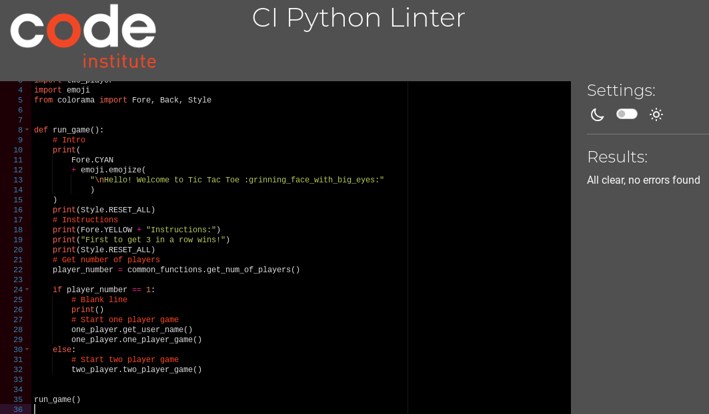
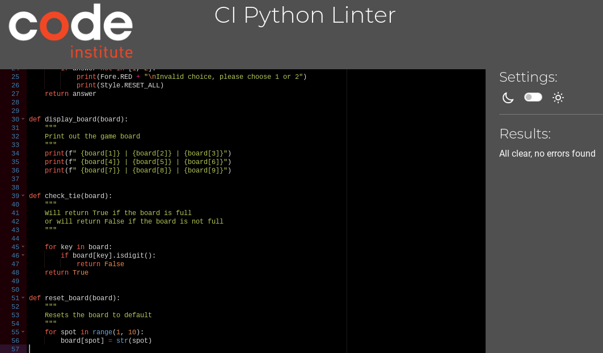
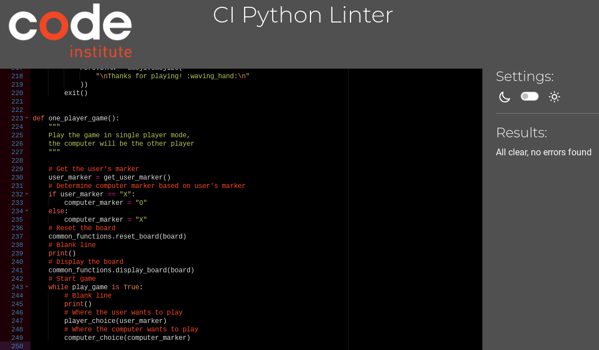
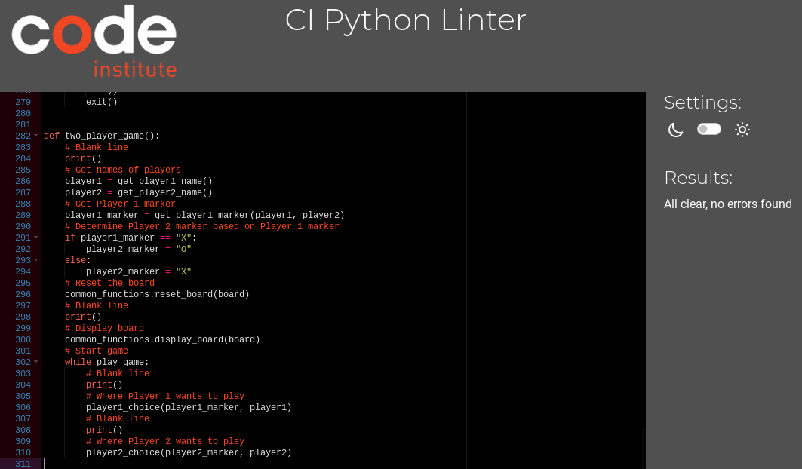

# Technologies Used
* Python3 - Delivers the structure and content for the game
* Git - For version control
*  Gitpod - Used to develop the game
* Gitbash - Terminal used to push changes to the GitHub repository
* GitHub - Used to host the game
* Heroku - Used to deploy the game
* [Lucid](https://lucid.app/documents?referringApp=slack#/documents?folder_id=recent) - Used to create flowchart
* [ezgif.com](https://ezgif.com/) - Used to create Gif
* [Colorama](https://pypi.org/project/colorama/) - Used to add colour to the terminal
* [Emoji](https://pypi.org/project/emoji/) - Used to add emojis to the terminal
* [Black](https://pypi.org/project/black/) - Used to format code
* [PyPI](https://pypi.org/) - Used to import Colorama and Emoji packages
*  [CI Python Linter](https://pep8ci.herokuapp.com/) - Used to validate code

# Testing
Testing was ongoing throughout the entire build. As this game runs on a mock terminal, it will not work on mobile devices so no accessibility or responsitivity testing was required.

### Code Institute Python Linter
Validation was done using [CI Python Linter](https://pep8ci.herokuapp.com/) 

run.py

common_functions.py

one_player.py

two_player.py

### Manual Testing
To fully test my game, I performed the following tests:

| Test                                                                 | Action                                                                        | Expected Result                                                                                                                                                                                                                                            | Pass/Fail |
| -------------------------------------------------------------------- | ----------------------------------------------------------------------------- | ---------------------------------------------------------------------------------------------------------------------------------------------------------------------------------------------------------------------------------------------------------- | --------- |
| get_num_of_players()                                                 | Enter h Enter 6 Enter 1 Enter 2                                      | Error message, ask user to try again Error message, ask user to try again Ask for user's name Ask player 1 to enter name                                                                                                                          | Pass      |
| get_user_name()                                                      | Enter 5 Enter am Enter dan1 Enter mynameislong Enter tee          | Error message, ask user to try again Error message, ask user to try again Error message, ask user to try again Error message, ask user to try again Ask user to select X or O                                                                  | Pass      |
| get_user_marker()                                                    | Enter 5 Enter a Enter . Enter x Enter o                           | Error message, ask user to try again Error message, ask user to try again Error message, ask user to try again Ask where user wants to play Ask where user wants to play                                                                       | Pass      |
| player_choice()                                                      | Enter 0 Enter a Enter . Enter 1                                      | Error message, ask user to try again Error message, ask user to try again Error message, ask user to try again Replace 1 with marker and print the board                                                                                          | Pass      |
| check_winner(player)                                                 | Win against computer Lose against computer Tie with computer            | Print that player has won Print that computer has won Print that there is a tie                                                                                                                                                                      | Pass      |
| play_again()                                                         | Enter 5 Enter ok Enter . Enter n Enter no Enter y Enter yes | Error message, ask user to try again Error message, ask user to try again Error message, ask user to try again Thank user for playing and exit game Thank user for playing and exit game Restart one player game Restart one player game | Pass      |
| get_player1_name()                                                   | Enter 5 Enter am Enter dan1 Enter mynameislong Enter tee          | Error message, ask user to try again Error message, ask user to try again Error message, ask user to try again Error message, ask user to try again Ask player 2 to enter name                                                                 | Pass      |
| get_player2_name()                                                   | Enter 5 Enter am Enter dan1 Enter mynameislong Enter dee          | Error message, ask user to try again Error message, ask user to try again Error message, ask user to try again Error message, ask user to try again Ask player 1 to select X or O                                                              | Pass      |
| player1_choice(player1_marker, player1)                              | Enter 5 Enter a Enter . Enter x Enter o                           | Error message, ask user to try again Error message, ask user to try again Error message, ask user to try again Ask where player1 wants to play Ask where player1 wants to play                                                                 | Pass      |
| place_marker(board, position, marker, player1, player2, player=None) | Enter 0 Enter a Enter . Enter 1                                      | Error message, ask user to try again Error message, ask user to try again Error message, ask user to try again Replace 1 with marker and print the board                                                                                          | Pass      |
| player2_choice(player2_marker, player2)                              | Enter 0 Enter a Enter . Enter 1 Enter 3                           | Error message, ask user to try again Error message, ask user to try again Error message, ask user to try again Error message, ask user to try again Replace 3 with marker and print the board                                                  | Pass      |
| check_winner(player1, player2, player)                               | Player 1 beats Player 2 Player 2 beats Player 1 Tie                     | Print that Player 1 has won Print that Player 2 has won Print that there is a tie                                                                                                                                                                    | Pass      |
| play_again()                                                         | Enter 5 Enter ok Enter . Enter n Enter no Enter y Enter yes | Error message, ask user to try again Error message, ask user to try again Error message, ask user to try again Thank user for playing and exit game Thank user for playing and exit game Restart two player game Restart two player game | Pass      |

