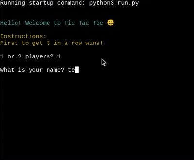
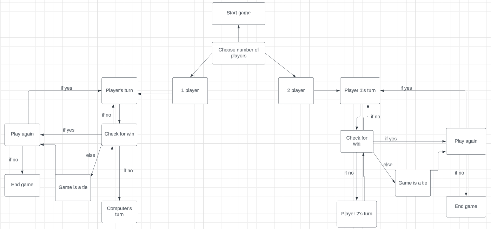
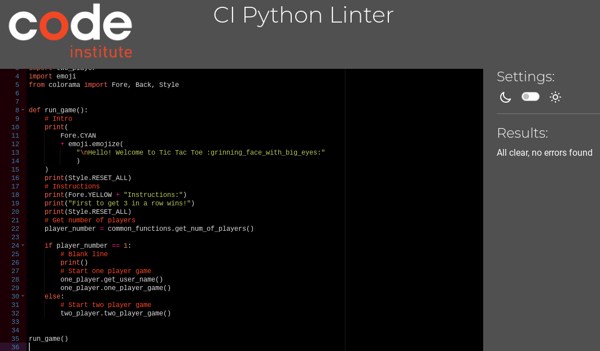
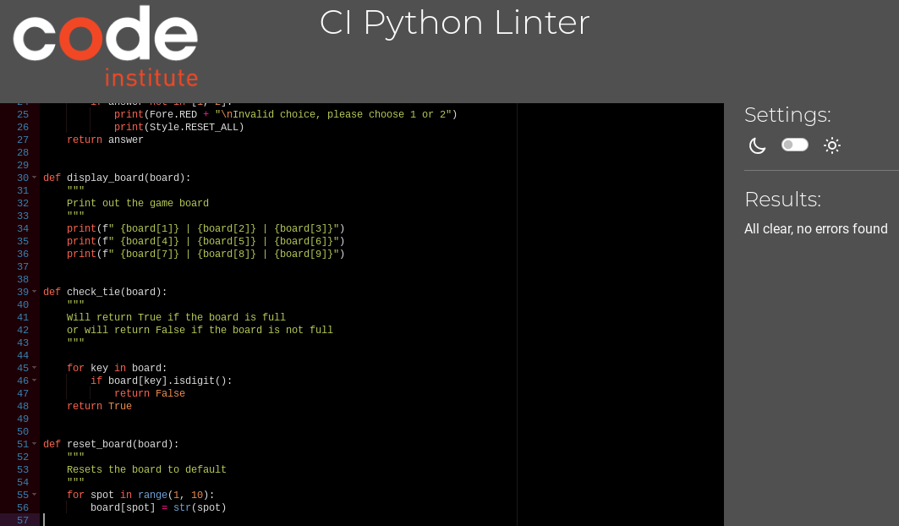
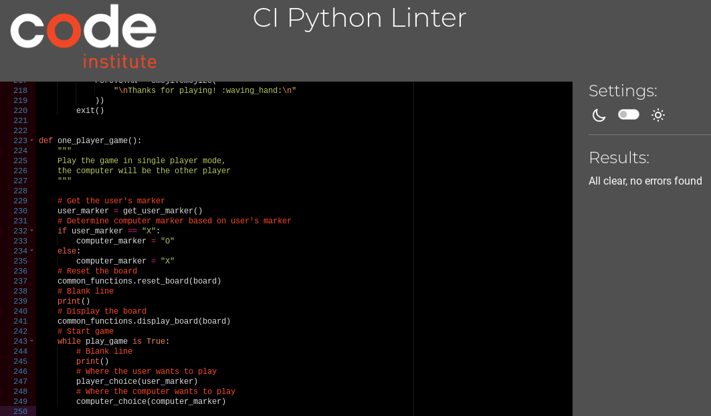
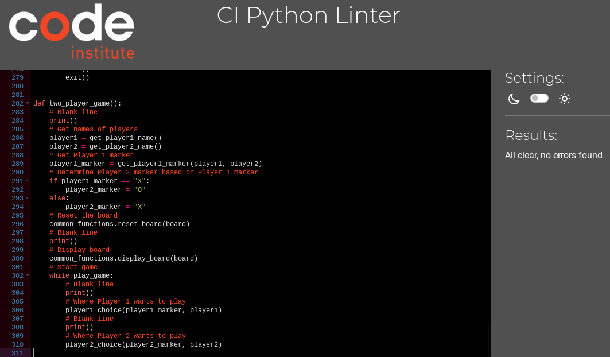

# Tic-Tac-Toe
Tic Tac Toe is a classic game that is played of a 3x3 grid, where 2 players take turns marking X's and O's. The goal is to get 3 of your marks in a row, either horizontally, vertically, or diagonally.

You can view the live site here - [Tic-Tac-Toe](https://tic-tac-toe--game-104c3ae4c4ea.herokuapp.com/)

# User Experience (UX)
## Target Audience
* Users that would like to play a game of tic-tac-toe
* Users who would like to play a game of tic-tac-toe versus a computer
* Users who would like to play a 2-player game of tic-tac-toe

## User Stories
* A user should be able to determine how to play the game
* A user should be able to easily and intuitively navigate the game
* A user should find it easy to know whose turn it is
* A user should find it easy to determine the winner of the game

## App Aims
* To offer a fun game to play
* To allow a single player to play against the computer
* To allow two players to play against each other

# Design
## Flowchart

## Color Scheme
* Error messages are printed in red
* The introduction message is printed in cyan
* In the single player game, the message is printed in green if the user wins
* In the single player game, the message is printed in blue if the user loses
* In the two player game, the message is printed in green when Player 1 or Player 2 wins
* When there is a tie, the message is printed in yellow

## Future Implementations
 I would like to develop this game using Pygame to create a more interactive and user friendly game that is responsive and can be played on various devices.

# Technologies Used
* Python3 - Delivers the structure and content for the game
* Git - For version control
*  Gitpod - Used to develop the game
* Gitbash - Terminal used to push changes to the GitHub repository
* GitHub - Used to host the game
* Heroku - Used to deploy the game
* [Lucid](https://lucid.app/documents?referringApp=slack#/documents?folder_id=recent) - Used to create flowchart
* [ezgif.com](https://ezgif.com/) - Used to create Gif
* [Colorama](https://pypi.org/project/colorama/) - Used to add colour to the terminal
* [Emoji](https://pypi.org/project/emoji/) - Used to add emojis to the terminal
* [Black](https://pypi.org/project/black/) - Used to format code
* [PyPI](https://pypi.org/) - Used to import Colorama and Emoji packages
*  [CI Python Linter](https://pep8ci.herokuapp.com/) - Used to validate code

# Deployment & Local Development
## Deployment
The app was deployed to Heroku via the following steps:
1. Log in (or sign up) to Heroku
2. Click New on the top right
3. Choose create new app
4. Choose name and region and click create app
5. In the settings tab, click on Reveal Config Vars and add the key Port and the value 8000
6. Add python and nodejs buildpacks specifically in that order
7. In the deploy tab, choose GitHub as deployment method and connect repository
8. In Manual deploy section, click Deploy Branch

## Local Development
### How to Fork
To fork the Tic-Tac-Toe repository:
1. Log in (or sign up) to Github
2. Go to the repository for this project
3. Click the Fork button in the top right corner

### How to Clone
To clone the Tic-Tac-Toe repository:
1. Log in (or sign up) to Github
2. Go to the repository for this project
3. Click on the code button, select whether you would like to clone with HTTPS, SSH or GitHub CLI
4. Copy the link shown
5. Open the terminal in your code editor and change the current working directory to the location you want to use for the cloned directory
6. Type 'git clone' into the terminal 
7. Paste the link you copied in step 3
8. Press enter

# Testing
Testing was ongoing throughout the entire build. As this game runs on a mock terminal, it will not work on mobile devices so no accessibility or responsitivity testing was required.

### Code Institute Python Linter
Validation was done using [CI Python Linter](https://pep8ci.herokuapp.com/) 

run.py

common_functions.py

one_player.py

two_player.py

### Manual Testing
To fully test my game, I performed the following tests:

| Test                                                                 | Action                                                                                                | Expected Result                                                                                                                                                                                                                                                                    | Pass/Fail |
| -------------------------------------------------------------------- | ----------------------------------------------------------------------------------------------------- | ---------------------------------------------------------------------------------------------------------------------------------------------------------------------------------------------------------------------------------------------------------------------------------- | --------- |
| get_num_of_players()                                                 | Enter h  Enter 6  Enter 1  Enter 2                                                  | Error message, ask user to try again  Error message, ask user to try again  Ask for user's name  Ask player 1 to enter name                                                                                                                                      | Pass      |
| get_user_name()                                                      | Enter 5  Enter am  Enter dan1  Enter mynameislong  Enter tee                  | Error message, ask user to try again  Error message, ask user to try again  Error message, ask user to try again  Error message, ask user to try again  Ask user to select X or O                                                                          | Pass      |
| get_user_marker()                                                    | Enter 5  Enter a  Enter .  Enter x  Enter o                                   | Error message, ask user to try again  Error message, ask user to try again  Error message, ask user to try again  Ask where user wants to play  Ask where user wants to play                                                                               | Pass      |
| player_choice()                                                      | Enter 0  Enter a  Enter .  Enter 1                                                  | Error message, ask user to try again  Error message, ask user to try again  Error message, ask user to try again  Replace 1 with marker and print the board                                                                                                      | Pass      |
| check_winner(player)                                                 | Win against computer  Lose against computer  Tie with computer                            | Print that player has won  Print that computer has won  Print that there is a tie                                                                                                                                                                                      | Pass      |
| play_again()                                                         | Enter 5  Enter ok  Enter .  Enter n  Enter no  Enter y  Enter yes | Error message, ask user to try again  Error message, ask user to try again  Error message, ask user to try again  Thank user for playing and exit game  Thank user for playing and exit game  Restart one player game  Restart one player game | Pass      |
| get_player1_name()                                                   | Enter 5  Enter am  Enter dan1  Enter mynameislong  Enter tee                  | Error message, ask user to try again  Error message, ask user to try again  Error message, ask user to try again  Error message, ask user to try again  Ask player 2 to enter name                                                                         | Pass      |
| get_player2_name()                                                   | Enter 5  Enter am  Enter dan1  Enter mynameislong  Enter dee                  | Error message, ask user to try again  Error message, ask user to try again  Error message, ask user to try again  Error message, ask user to try again  Ask player 1 to select X or O                                                                      | Pass      |
| player1_choice(player1_marker, player1)                              | Enter 5  Enter a  Enter .  Enter x  Enter o                                   | Error message, ask user to try again  Error message, ask user to try again  Error message, ask user to try again  Ask where player1 wants to play  Ask where player1 wants to play                                                                         | Pass      |
| place_marker(board, position, marker, player1, player2, player=None) | Enter 0  Enter a  Enter .  Enter 1                                                  | Error message, ask user to try again  Error message, ask user to try again  Error message, ask user to try again  Replace 1 with marker and print the board                                                                                                      | Pass      |
| player2_choice(player2_marker, player2)                              | Enter 0  Enter a  Enter .  Enter 1  Enter 3                                   | Error message, ask user to try again  Error message, ask user to try again  Error message, ask user to try again  Error message, ask user to try again  Replace 3 with marker and print the board                                                          | Pass      |
| check_winner(player1, player2, player)                               | Player 1 beats Player 2  Player 2 beats Player 1  Tie                                     | Print that Player 1 has won  Print that Player 2 has won  Print that there is a tie                                                                                                                                                                                    | Pass      |
| play_again()                                                         | Enter 5  Enter ok  Enter .  Enter n  Enter no  Enter y  Enter yes | Error message, ask user to try again  Error message, ask user to try again  Error message, ask user to try again  Thank user for playing and exit game  Thank user for playing and exit game  Restart two player game  Restart two player game | Pass      |

# Bugs
### Known Bugs
1. In the 2 player game, the users are asked for their names again when they choose to play again.

# Credits
* Emojis were sourced from [PyPI](https://pypi.org/project/emoji/)
* Colorama was learned from [PyPI](https://pypi.org/project/colorama/)
*  Black was learned from [PyPI](https://pypi.org/project/black/)
* Images were compressed by [iLoveIMG](https://www.iloveimg.com/)
* https://ezgif.com/
* isalpha() method was learned from [W3 Schools](https://www.w3schools.com/python/ref_string_isalpha.asp#:~:text=The%20isalpha()%20method%20returns,!%23%25%26%3F%20etc.)

# Acknowledgements
This game was designed and developed in conjunction with the Full Stack Software Developer Diploma course (ecommerce) at the Code Institute. I would like to thank my mentor, Daisy, the Slack community, and Code Institute for all their support.